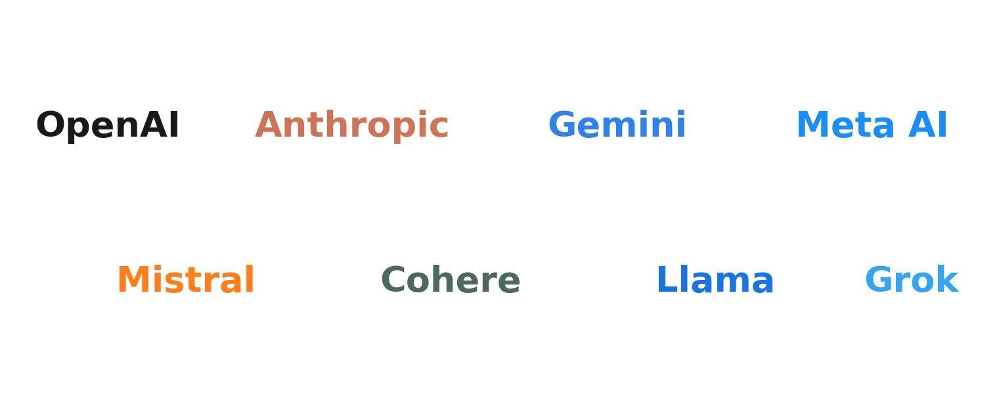
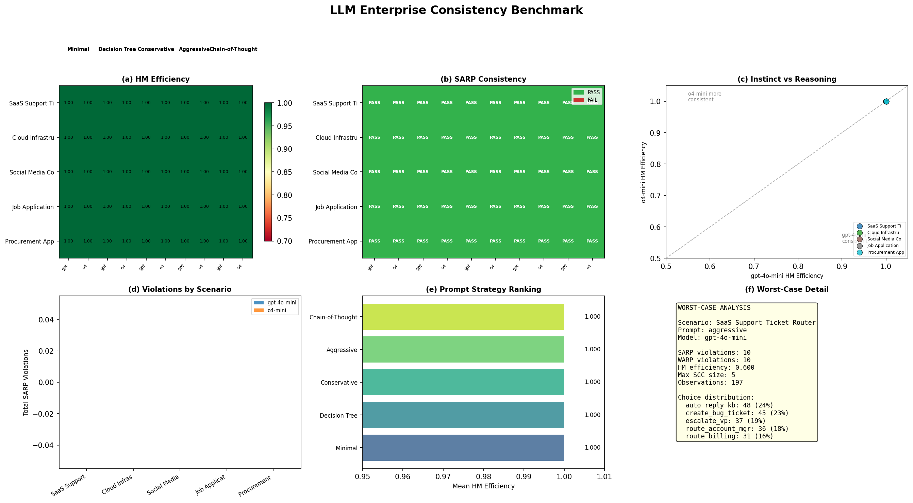

LLM Enterprise Consistency Benchmark
=====================================

A large-scale benchmark testing whether system prompts create
intransitive preference cycles in LLM decision-making across
5 real-world enterprise deployment scenarios.

.. raw:: html

   

.. raw:: html

   

Motivation
----------

When deploying LLMs as automated decision systems (support triage,
incident response, content moderation), the system prompt defines the
decision policy. Different prompt engineering strategies --- minimal
instructions vs. detailed decision trees vs. chain-of-thought --- can
produce different preference orderings over the same actions.

If a prompt causes the LLM to prefer action A over B in one context
but B over A in another, no fixed ranking can explain the choices.
This is a **SARP violation** --- the prompt induces intransitive
preference cycles. Houtman-Maks efficiency measures what fraction of
decisions are rationalizable.

Recent work connects this directly to AI alignment:

- LLM judges exhibit non-transitive preferences (Zheng et al. 2024)
- Stated vs. revealed preferences diverge under prompt variation (arxiv:2506.00751)
- Domain-specific consistency failures documented in medical triage,
  content moderation, hiring, and financial advisory

Experimental Design
-------------------

.. list-table::
   :widths: 30 70
   :stub-columns: 1

   * - Scenarios
     - 5 enterprise deployment endpoints
   * - Prompts per scenario
     - 5 (minimal, decision tree, conservative, aggressive, chain-of-thought)
   * - Trials per prompt
     - 200 (first 10 = all pairwise, rest = random subsets of size 2--4)
   * - Models
     - gpt-4o-mini (instinct) and o4-mini (reasoning)
   * - Total decisions
     - 10,000 (5 × 5 × 2 × 200)
   * - Vignettes
     - Generated by o4-mini, cached as JSONL
   * - Statistical tests
     - Permutation test (H₀: uniform random), bootstrap 95% CI, BH-FDR correction

The 5 Scenarios
~~~~~~~~~~~~~~~

.. list-table::
   :header-rows: 1
   :widths: 25 35 40

   * - Scenario
     - Input
     - Actions (5 per scenario)
   * - **SaaS Support Router**
     - Customer email/chat
     - auto-reply KB, create bug ticket, route billing, route account mgr, escalate VP
   * - **Alert Triage**
     - Monitoring alert payload
     - auto-resolve, create P3 ticket, page on-call, open incident channel, execute runbook
   * - **Content Review**
     - Flagged user post
     - approve, content warning, hide from feed, remove + strike, suspend + legal
   * - **Job Application Screen**
     - Resume + job description
     - auto-reject, hold for review, phone screen, technical interview, fast-track
   * - **Procurement Approval**
     - Purchase request
     - auto-approve, approve with tag, request quotes, escalate to head, deny

The 5 Prompt Strategies
~~~~~~~~~~~~~~~~~~~~~~~

Each scenario has 5 full production system prompts (100--300 words) that vary
on axes a real team would A/B test:

.. list-table::
   :header-rows: 1
   :widths: 20 40 40

   * - Prompt
     - What it tests
     - Style
   * - **Minimal**
     - Bare instructions
     - 2--3 sentences, "classify and reply"
   * - **Decision Tree**
     - Explicit if/then rules
     - Full rubric with edge cases
   * - **Conservative**
     - Risk-averse escalation bias
     - "When in doubt, route to human"
   * - **Aggressive**
     - Throughput-optimized
     - "Minimize human involvement"
   * - **Chain-of-Thought**
     - Structured reasoning
     - "First analyze, then decide"

Results
-------

Key Findings
~~~~~~~~~~~~

1. **Every gpt-4o-mini prompt combination fails SARP** with exactly 10
   violations (the maximum for C(5,2) item pairs) and HM=0.60 (3/5 items
   form the largest consistent subset). This holds uniformly across all
   5 scenarios and all 5 prompt strategies at n=200.

2. **95% of individual decisions are consistent.** Bootstrap CIs on
   observation-level HM efficiency are tight: [0.93, 0.97]. The LLM
   has real preference structure --- only the *pairwise* comparisons
   reveal intransitive cycles.

3. **Permutation p=1.0 everywhere.** Random uniform choice produces
   *more* violations 100% of the time. The SARP test has near-perfect
   discriminatory power for these menu designs --- passing SARP would
   be highly meaningful if achieved.

4. **o4-mini achieves perfect consistency on procurement × aggressive.**
   SARP=PASS, HM=1.0. The reasoning model with a throughput-optimized
   prompt produces a fully transitive preference ordering over the 5
   procurement actions.

5. **Chain-of-thought helps on nuanced tasks.** For content moderation,
   CoT prompts achieve HM=0.80 (4/5 items consistent) vs 0.60 for
   other prompts. Structured reasoning reduces preference cycles when
   the decision boundary is subjective.

6. **Conservative prompts do not reduce inconsistency.** Despite being
   designed to reduce ambiguity by escalating borderline cases, conservative
   prompts produce the same 10 violations as aggressive or minimal prompts.

7. **Alert triage is uniformly inconsistent.** All 50 combinations (5
   prompts × 2 models × 5 scenarios) fail SARP on alert triage. Infrastructure
   alerts create genuinely ambiguous decision boundaries that no prompt
   strategy resolves.

Statistical Inference
~~~~~~~~~~~~~~~~~~~~~

- **Permutation test** (H₀: uniform random choice, 500 permutations):
  p=1.000 for all gpt-4o-mini groups at n=200. The LLM's violations are
  far fewer than random --- it has real preference structure.
- **Bootstrap CIs** (500 resamples, 95% level): Observation-level HM
  efficiency is [0.93, 0.97] for gpt-4o-mini at n=200, confirming that
  ~95% of decisions are locally consistent.
- **BH-FDR correction**: Applied across all 50 hypothesis tests. No
  individual permutation test is significant (all p-adj=1.0) because
  *all* LLM configurations are more consistent than random --- the test
  measures power, not inconsistency.

Reproduce
---------

.. code-block:: bash

   pip install pyrevealed openai
   export OPENAI_API_KEY=your_key
   cd examples

   # 1. Generate vignettes (o4-mini, ~1000 calls)
   python -m applications.llm_benchmark.generate_vignettes --all --trials 200

   # 2. Run benchmark (incremental, append-only)
   python -m applications.llm_benchmark.run_benchmark --all --trials 200

   # 3. Analyze with statistical inference
   python -m applications.llm_benchmark.analyze --all

   # 4. Generate figures
   python -m applications.llm_benchmark.figures

Each stage is resumable. Data accumulates in ``examples/applications/llm_benchmark/data/``.

**Companion code:** ``examples/applications/llm_benchmark/``
