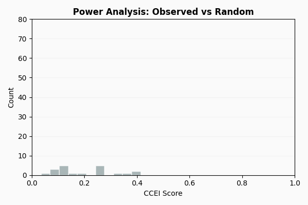

Tutorial 1: Budget-Based Analysis
==================================

This tutorial analyzes 2 years of grocery data from 2,222 households using
revealed preference methods.

Topics covered:

- Data preparation and BehaviorLog construction
- GARP consistency testing
- Power analysis (Bronars test)
- Efficiency metrics (CCEI, MPI, Houtman-Maks)
- Preference structure (separability, cross-price effects)
- Lancaster characteristics model

Prerequisites
-------------

- Python 3.10+
- Basic familiarity with NumPy and pandas
- Understanding of basic statistics (means, correlations)

.. note::

   The full code for this tutorial is available in the ``case_studies/dunnhumby/`` directory
   of the PrefGraph repository.

.. _important-assumptions:

Important Assumptions
---------------------

Revealed preference tests rely on several core assumptions regarding the stability and rationality of decision-making. For a formal delineation of these assumptions and their implications, see:

- :doc:`theory_foundations` - Formal assumptions (Stability, Utility Maximization, etc.)

Real data typically violates these to some degree, which affects interpretation:

.. list-table:: Assumptions in Practice (Grocery Data)
   :header-rows: 1
   :widths: 30 35 35

   * - Assumption
     - Grocery Data Reality
     - Concern Level
   * - Stable preferences
     - Household tastes change over 2 years
     - Medium
   * - Single decision-maker
     - Household, not individual
     - Medium
   * - Category homogeneity
     - "Milk" aggregates all milk products
     - Medium

What GARP Failure Means
~~~~~~~~~~~~~~~~~~~~~~~

GARP failure means no single, stable utility function rationalizes the observed
choices. For common causes and behavioral interpretations, see :doc:`theory_consistency`.

Part 1: The Data
----------------

The **Dunnhumby "The Complete Journey"** dataset contains 2 years of grocery
transactions from approximately 2,500 households. We focus on 10 product
categories.

.. list-table:: Dataset Overview
   :header-rows: 1
   :widths: 40 60

   * - Metric
     - Value
   * - Households analyzed
     - 2,222
   * - Product categories
     - 10 (Soda, Milk, Bread, Cheese, Chips, Soup, Yogurt, Beef, Pizza, Lunchmeat)
   * - Time period
     - 2 years
   * - Aggregation
     - **Monthly** (24 observations per household)

Aggregation Choice
~~~~~~~~~~~~~~~~~~

Transactions are aggregated to **monthly** observations:

- Weekly data is too sparse (many zero-purchase periods)
- Monthly aligns with household budgeting cycles
- Reduces noise from random shopping timing

.. code-block:: bash

   pip install prefgraph[viz]

   # Download the Dunnhumby dataset (requires Kaggle API)
   cd dunnhumby && ./download_data.sh

Part 2: Building BehaviorLogs
-----------------------------

A ``BehaviorLog`` stores a sequence of choice observations:

- **Prices**: Price vector at time of choice
- **Quantities**: Quantity vector chosen

.. code-block:: python

   import numpy as np
   from prefgraph import BehaviorLog

   # For a single household: 24 months, 10 products
   prices = np.array([
       [2.50, 3.20, 2.10, 4.50, 3.00, 1.80, 2.90, 8.50, 5.00, 6.20],  # Month 1
       [2.45, 3.30, 2.15, 4.40, 2.90, 1.85, 3.00, 8.20, 5.10, 6.00],  # Month 2
       # ... more months
   ])

   quantities = np.array([
       [2.0, 1.5, 3.0, 0.5, 1.0, 2.0, 1.0, 0.5, 0.0, 0.5],  # Month 1
       [1.5, 2.0, 2.5, 0.5, 1.5, 1.5, 1.0, 0.5, 1.0, 0.0],  # Month 2
       # ... more months
   ])

   log = BehaviorLog(
       cost_vectors=prices,
       action_vectors=quantities,
       user_id="household_123"
   )

   print(f"Observations: {log.num_records}")  # 24
   print(f"Products: {log.num_goods}")        # 10

Output:

.. code-block:: text

   Observations: 24
   Products: 10

Price Imputation
~~~~~~~~~~~~~~~~

For zero-purchase categories, impute prices using market medians:

.. code-block:: python

   def build_behavior_log(transactions_df, household_id, categories, price_oracle):
       """Transform transactions to BehaviorLog format."""
       hh_df = transactions_df[transactions_df['household_id'] == household_id]
       hh_df['period'] = hh_df['date'].dt.to_period('M')

       # Build quantity matrix
       quantities = hh_df.pivot_table(
           index='period',
           columns='category',
           values='quantity',
           aggfunc='sum',
           fill_value=0
       )

       # Build price matrix: user's price if purchased, oracle otherwise
       prices = pd.DataFrame(index=quantities.index, columns=categories)
       for period in quantities.index:
           for cat in categories:
               if quantities.loc[period, cat] > 0:
                   mask = (hh_df['period'] == period) & (hh_df['category'] == cat)
                   prices.loc[period, cat] = hh_df[mask]['price'].median()
               else:
                   prices.loc[period, cat] = price_oracle.loc[period, cat]

       return BehaviorLog(
           cost_vectors=prices.values,
           action_vectors=quantities.values,
           user_id=household_id
       )

Part 3: Testing Consistency (GARP)
----------------------------------

The Generalized Axiom of Revealed Preference (GARP) tests whether choices can
be explained by a utility function. Choosing bundle A when B was affordable
reveals A ≿ B. GARP checks whether these revealed preferences form a consistent
(acyclic) ordering.

.. code-block:: python

   from prefgraph import validate_consistency

   # Test a single household
   result = validate_consistency(log)

   if result.is_consistent:
       print("GARP satisfied - a utility function exists")
   else:
       print(f"GARP violated - {result.num_violations} contradictions found")

Output (typical for one household):

.. code-block:: text

   GARP violated - 18 contradictions found

Full Summary Report
~~~~~~~~~~~~~~~~~~~

For detailed diagnostics, use the ``.summary()`` method:

.. code-block:: python

   print(result.summary())

.. code-block:: text

   ================================================================================
                               GARP CONSISTENCY REPORT
   ================================================================================

   Status: CONSISTENT

   Metrics:
   -------
     Consistent ......................... Yes
     Violations ........................... 0
     Observations ......................... 2

   Interpretation:
   --------------
     Behavior is consistent with utility maximization.
     No revealed preference cycles detected.

   Computation Time: 0.23 ms
   ================================================================================

Testing All Households
~~~~~~~~~~~~~~~~~~~~~~

.. code-block:: python

   consistent_count = 0
   for household_id, session_data in sessions.items():
       result = validate_consistency(session_data.behavior_log)
       if result.is_consistent:
           consistent_count += 1

   total = len(sessions)
   print(f"GARP pass rate: {consistent_count}/{total} ({100*consistent_count/total:.1f}%)")

Output:

.. code-block:: text

   GARP pass rate: 100/2222 (4.5%)

Typical GARP pass rates for field data range from 5-15%, reflecting assumption
violations over long time horizons (see :ref:`important-assumptions`).

Part 3a: Lenient Consistency (Acyclical P)
------------------------------------------

When GARP fails, it may be due to *strict* preference cycles or merely *weak*
preference violations. The **Acyclical P** test distinguishes these cases by
only checking strict preferences.

.. code-block:: python

   from prefgraph import validate_strict_consistency

   result = validate_strict_consistency(log)

   if result.is_consistent:
       if result.garp_consistent:
           print("Fully GARP consistent")
       else:
           print("Approximately rational: only weak preference violations")
   else:
       print(f"Strict preference cycles found: {len(result.violations)}")

Output (typical household that fails GARP):

.. code-block:: text

   Approximately rational: only weak preference violations

Interpretation
~~~~~~~~~~~~~~

.. list-table:: Acyclical P vs GARP
   :header-rows: 1
   :widths: 30 35 35

   * - Scenario
     - GARP
     - Acyclical P
   * - Strict preference cycles
     - Fails
     - Fails
   * - Only weak violations
     - Fails
     - Passes
   * - No violations
     - Passes
     - Passes

Use this test when:

- GARP fails narrowly and you want to know if violations are "close calls"
- You believe bundles at similar expenditure levels may be indifferent
- You want to allow for small measurement error in prices/quantities

.. code-block:: python

   # Detailed analysis
   print(f"Strict preferences: {result.num_strict_preferences}")
   print(f"GARP would pass: {result.garp_consistent}")

   if result.violations:
       print(f"Strict cycle example: {result.violations[0]}")

Part 4: Assessing Test Power
----------------------------

The Bronars (1987) test assesses whether GARP has discriminative power by
simulating random behavior on the same budgets and measuring violation rates.

.. code-block:: python

   from prefgraph import compute_test_power

   # Test power for a sample of households
   power_scores = []
   for household_id in sample_households:
       log = sessions[household_id].behavior_log
       result = compute_test_power(log, n_simulations=500)
       power_scores.append(result.power_index)

   print(f"Mean Bronars power: {np.mean(power_scores):.3f}")

Output:

.. code-block:: text

   Mean Bronars power: 0.942

Interpreting Power
~~~~~~~~~~~~~~~~~~

.. list-table:: Power Interpretation
   :header-rows: 1
   :widths: 25 75

   * - Power
     - Interpretation
   * - > 0.90
     - Random behavior almost always violates GARP
   * - 0.70 - 0.90
     - GARP results are informative
   * - 0.50 - 0.70
     - Limited discriminative power
   * - < 0.50
     - GARP cannot distinguish consistent from random behavior

With 24 observations and 10 goods, power typically exceeds 0.90.

Detailed Bronars Power Analysis
~~~~~~~~~~~~~~~~~~~~~~~~~~~~~~~

For deeper analysis, use the full result object which includes simulation details:

.. code-block:: python

   from prefgraph import compute_test_power

   result = compute_test_power(log, n_simulations=1000)

   print(f"Power Index: {result.power_index:.3f}")
   print(f"Statistically Significant: {result.is_significant}")
   print(f"Random violations: {result.n_violations}/{result.n_simulations}")
   print(f"Mean integrity of random: {result.mean_integrity_random:.3f}")

Output:

.. code-block:: text

   Power Index: 0.942
   Statistically Significant: True
   Random violations: 942/1000
   Mean integrity of random: 0.723

The ``mean_integrity_random`` shows the average efficiency score (AEI/CCEI)
of randomly generated behavior. If your household's CCEI is much higher
than this baseline, it strongly suggests non-random behavior.

For faster computation (without AEI tracking), use:

.. code-block:: python

   from prefgraph import compute_test_power_fast

   result = compute_test_power_fast(log, n_simulations=5000)
   print(f"Power: {result.power_index:.3f}")

Part 5: Measuring Efficiency (CCEI)
-----------------------------------

The **Critical Cost Efficiency Index (CCEI)**, also called the Afriat Efficiency
Index, quantifies the degree of GARP violation. A CCEI of 1.0 indicates perfect
consistency; lower values indicate larger budget adjustments needed to
rationalize behavior.

.. code-block:: python

   from prefgraph import compute_integrity_score

   ccei_scores = []
   for household_id, session_data in sessions.items():
       result = compute_integrity_score(session_data.behavior_log)
       ccei_scores.append(result.efficiency_index)

   print(f"Mean CCEI: {np.mean(ccei_scores):.3f}")
   print(f"Median CCEI: {np.median(ccei_scores):.3f}")
   print(f"CCEI ≥ 0.95: {np.mean(np.array(ccei_scores) >= 0.95)*100:.1f}%")
   print(f"CCEI < 0.70: {np.mean(np.array(ccei_scores) < 0.70)*100:.1f}%")

Output:

.. code-block:: text

   Mean CCEI: 0.839
   Median CCEI: 0.856
   CCEI ≥ 0.95: 11.2%
   CCEI < 0.70: 5.8%

Full Summary Report
~~~~~~~~~~~~~~~~~~~

.. code-block:: python

   print(result.summary())

.. code-block:: text

   ================================================================================
                            AFRIAT EFFICIENCY INDEX REPORT
   ================================================================================

   Status: PERFECT (AEI = 1.0)

   Metrics:
   -------
     Efficiency Index (AEI) .......... 1.0000
     Waste Fraction .................. 0.0000
     Perfectly Consistent ............... Yes
     Binary Search Iterations ............. 0
     Tolerance ................... 1.0000e-06

   Interpretation:
   --------------
     Perfect consistency - behavior fully rationalized by utility maximization

   Computation Time: 0.04 ms
   ================================================================================

Benchmark Comparison
~~~~~~~~~~~~~~~~~~~~

.. list-table:: Dunnhumby vs. CKMS (2014) Lab Experiments
   :header-rows: 1
   :widths: 40 30 30

   * - Metric
     - Dunnhumby (Grocery)
     - CKMS (Lab)
   * - GARP pass rate
     - ~5-15%
     - 22.8%
   * - Mean CCEI
     - ~0.80-0.85
     - 0.881
   * - Median CCEI
     - ~0.85-0.90
     - 0.95
   * - CCEI ≥ 0.95
     - ~20-30%
     - 45.2%

Lower consistency in field data reflects measurement noise, longer time horizons,
and multiple decision-makers per household.

CCEI Interpretation
~~~~~~~~~~~~~~~~~~~

.. list-table::
   :header-rows: 1
   :widths: 20 80

   * - CCEI
     - Interpretation
   * - 1.00
     - GARP satisfied
   * - 0.95+
     - Minor deviations
   * - 0.85-0.95
     - Typical for field data
   * - 0.70-0.85
     - Substantial deviations
   * - < 0.70
     - Large deviations; verify data quality

Part 6: Welfare Loss (MPI)
--------------------------

The **Money Pump Index (MPI)** measures potential welfare loss from preference
cycles (e.g., A ≻ B ≻ C ≻ A).

.. code-block:: python

   from prefgraph import compute_confusion_metric

   mpi_scores = []
   for household_id, session_data in sessions.items():
       result = compute_confusion_metric(session_data.behavior_log)
       mpi_scores.append(result.mpi_value)

   print(f"Mean MPI: {np.mean(mpi_scores):.3f}")

Output:

.. code-block:: text

   Mean MPI: 0.218

Full Summary Report
~~~~~~~~~~~~~~~~~~~

.. code-block:: python

   print(result.summary())

.. code-block:: text

   ================================================================================
                               MONEY PUMP INDEX REPORT
   ================================================================================

   Status: NO EXPLOITABILITY

   Metrics:
   -------
     Money Pump Index (MPI) .......... 0.0000
     Exploitability % ................ 0.0000
     Number of Cycles ..................... 0
     Total Expenditure .............. 31.7500

   Interpretation:
   --------------
     No exploitability - choices are fully consistent

   Computation Time: 0.02 ms
   ================================================================================

Mean MPI in this data is 0.2-0.25, with strong negative correlation to CCEI
(r ≈ -0.85).

.. list-table:: MPI Interpretation
   :header-rows: 1
   :widths: 20 80

   * - MPI
     - Interpretation
   * - 0
     - No preference cycles
   * - 0.1-0.2
     - Minor cycles
   * - 0.2-0.3
     - Moderate cycles
   * - > 0.3
     - Substantial cycles

Houtman-Maks Index
~~~~~~~~~~~~~~~~~~

The Houtman-Maks Index measures the minimum fraction of observations to remove
for GARP consistency.

.. code-block:: python

   from prefgraph import compute_minimal_outlier_fraction

   result = compute_minimal_outlier_fraction(log)
   print(f"Observations to remove: {result.fraction:.1%}")

Output (typical household):

.. code-block:: text

   Observations to remove: 12.5%

Full Summary Report
~~~~~~~~~~~~~~~~~~~

.. code-block:: python

   print(result.summary())

.. code-block:: text

   ================================================================================
                              HOUTMAN-MAKS INDEX REPORT
   ================================================================================

   Status: FULLY CONSISTENT

   Metrics:
   -------
     Fraction Removed ................ 0.0000
     Fraction Consistent ............. 1.0000
     Observations Removed ................. 0

   Interpretation:
   --------------
     All observations are consistent - no removal needed.

   Computation Time: 0.05 ms
   ================================================================================

CCEI, MPI, and Houtman-Maks capture different aspects of inconsistency.

Part 6a: Per-Observation Efficiency (VEI)
-----------------------------------------

While CCEI gives a single global efficiency score, **Varian's Efficiency Index
(VEI)** computes individual efficiency scores for each observation. This
identifies *which specific observations* are problematic.

.. code-block:: python

   from prefgraph import compute_granular_integrity

   result = compute_granular_integrity(log, efficiency_threshold=0.9)

   print(f"Mean efficiency: {result.mean_efficiency:.3f}")
   print(f"Worst observation: {result.worst_observation}")
   print(f"Min efficiency: {result.min_efficiency:.3f}")
   print(f"Problematic observations: {result.problematic_observations}")

Output:

.. code-block:: text

   Mean efficiency: 0.912
   Worst observation: 14
   Min efficiency: 0.723
   Problematic observations: [7, 14, 21]

Use Cases
~~~~~~~~~

- **Debugging**: Find which time periods have inconsistent behavior
- **Outlier detection**: Identify transactions to investigate
- **Time series analysis**: Track when behavior changed
- **Data quality**: Detect measurement errors or unusual events

.. code-block:: python

   # Investigate problematic observations
   for obs_idx in result.problematic_observations:
       efficiency = result.efficiency_vector[obs_idx]
       print(f"Observation {obs_idx}: efficiency={efficiency:.3f}")
       print(f"  Prices: {log.cost_vectors[obs_idx]}")
       print(f"  Quantities: {log.action_vectors[obs_idx]}")

L2 Variant
~~~~~~~~~~

For applications where large deviations matter more than small ones, use the
L2 variant which minimizes squared deviations:

.. code-block:: python

   from prefgraph import compute_granular_integrity_l2

   result_l2 = compute_granular_integrity_l2(log)
   print(f"L2 mean efficiency: {result_l2.mean_efficiency:.3f}")

Part 6b: Swaps Index
--------------------

The **Swaps Index** (Apesteguia & Ballester 2015) provides a more interpretable
measure of inconsistency than CCEI. Instead of asking "how much budget waste
rationalizes behavior?", it asks "how many preference reversals are needed?"

.. code-block:: python

   from prefgraph import compute_swaps_index

   result = compute_swaps_index(log)

   print(f"Swaps needed: {result.swaps_count}")
   print(f"Normalized (0-1): {result.swaps_normalized:.3f}")
   print(f"Consistent: {result.is_consistent}")

Output (typical household):

.. code-block:: text

   Swaps needed: 3
   Normalized (0-1): 0.011
   Consistent: False

Interpretation
~~~~~~~~~~~~~~

The swaps index is more intuitive than CCEI:

- **CCEI = 0.92** means "need 8% budget waste to rationalize"
- **Swaps = 3** means "need to flip 3 preference pairs for consistency"

.. list-table:: Swaps Index Interpretation
   :header-rows: 1
   :widths: 25 75

   * - Swaps
     - Interpretation
   * - 0
     - GARP consistent
   * - 1-3
     - Near-rational (minor inconsistencies)
   * - 4-10
     - Moderate inconsistency
   * - > 10
     - Substantial inconsistency; verify data quality

Identifying Which Pairs to Swap
~~~~~~~~~~~~~~~~~~~~~~~~~~~~~~~

The result includes the specific observation pairs that cause violations:

.. code-block:: python

   if result.swap_pairs:
       print("Preferences to reverse for consistency:")
       for obs_i, obs_j in result.swap_pairs:
           print(f"  Observation {obs_i} vs {obs_j}")

This is useful for understanding *where* the inconsistencies occur-perhaps
a few outlier periods drive all the violations.

Full Summary Report
~~~~~~~~~~~~~~~~~~~

.. code-block:: python

   print(result.summary())

.. code-block:: text

   ================================================================================
                                SWAPS INDEX REPORT
   ================================================================================

   Status: INCONSISTENT (3 swaps needed)

   Metrics:
   -------
     Swaps Count .......................... 3
     Swaps Normalized ................. 0.0109
     Max Possible Swaps ................. 276
     Consistent ........................... No
     Method .......................... greedy

   Swap Pairs:
   ----------
     (2, 14)
     (7, 21)
     (14, 19)

   Interpretation:
   --------------
     3 preference reversals needed for GARP consistency.
     This is a relatively low number, suggesting near-rational behavior.

   Computation Time: 1.23 ms
   ================================================================================

Part 6c: Observation Contributions
----------------------------------

When GARP fails, which observations are responsible? **Observation contributions**
(Varian 1990) identifies the "troublemakers"-useful for outlier detection and
data quality analysis.

.. code-block:: python

   from prefgraph import compute_observation_contributions

   result = compute_observation_contributions(log, method="cycle_count")

   print(f"Base AEI: {result.base_aei:.3f}")
   print(f"Most problematic observations:")
   for obs_idx, contrib in result.worst_observations[:3]:
       print(f"  Observation {obs_idx}: {contrib:.1%} of violations")

Output:

.. code-block:: text

   Base AEI: 0.856
   Most problematic observations:
     Observation 14: 23.5% of violations
     Observation 7: 18.2% of violations
     Observation 21: 12.8% of violations

Methods
~~~~~~~

Two methods are available:

.. list-table:: Contribution Methods
   :header-rows: 1
   :widths: 25 35 40

   * - Method
     - Speed
     - Use When
   * - ``"cycle_count"``
     - Fast (O(n²))
     - Large datasets, quick diagnostics
   * - ``"removal"``
     - Slow (O(n³))
     - Small datasets, precise impact measurement

The ``"removal"`` method computes how much AEI improves when each observation
is removed-this gives a direct measure of each observation's impact:

.. code-block:: python

   result = compute_observation_contributions(log, method="removal")

   print(f"Removal impact on AEI:")
   for obs_idx, impact in list(result.removal_impact.items())[:3]:
       print(f"  Remove obs {obs_idx}: AEI improves by {impact:.3f}")

Use Cases
~~~~~~~~~

1. **Data quality**: High-contribution observations may reflect measurement error
2. **Outlier detection**: Unusual shopping periods (holidays, stockpiling)
3. **Time series analysis**: Identify when preferences shifted
4. **Sample selection**: Remove problematic observations for cleaner analysis

.. code-block:: python

   # Investigate the worst observation
   worst_idx = result.worst_observations[0][0]
   print(f"Observation {worst_idx} details:")
   print(f"  Prices: {log.cost_vectors[worst_idx]}")
   print(f"  Quantities: {log.action_vectors[worst_idx]}")
   print(f"  Expenditure: ${np.dot(log.cost_vectors[worst_idx], log.action_vectors[worst_idx]):.2f}")

Full Summary Report
~~~~~~~~~~~~~~~~~~~

.. code-block:: python

   print(result.summary())

.. code-block:: text

   ================================================================================
                          OBSERVATION CONTRIBUTIONS REPORT
   ================================================================================

   Status: ANALYSIS COMPLETE

   Overview:
   --------
     Total Observations .................. 24
     Base AEI ......................... 0.8560
     Method ...................... cycle_count

   Worst Contributors:
   ------------------
     Observation 14 ................... 23.5%
     Observation 7 .................... 18.2%
     Observation 21 ................... 12.8%
     Observation 3 ..................... 8.4%
     Observation 18 .................... 7.1%

   Interpretation:
   --------------
     Top 3 observations account for 54.5% of all violation participation.
     Consider investigating these periods for data quality issues or
     unusual purchasing patterns.

   Computation Time: 2.45 ms
   ================================================================================

Part 7: Advanced Topics
-----------------------

For more complex budget-based analysis, see the following specialized tutorials:

- :doc:`tutorial_budget_advanced` - Homotheticity, Lancaster characteristics model, and utility recovery.
- :doc:`tutorial_demand_analysis` - Slutsky matrix, integrability, and additive separability.
- :doc:`tutorial_welfare` - Welfare analysis (CV/EV) and deadweight loss.

Part 8: Unified Summary Display
-------------------------------

For comprehensive analysis in one command, use the ``BehavioralSummary`` class
which runs all tests and presents results in a unified format.

One-Liner Analysis
~~~~~~~~~~~~~~~~~~

.. code-block:: python

   from prefgraph import BehavioralSummary

   # Run all tests with one command
   summary = BehavioralSummary.from_log(log)

   # Statsmodels-style text summary
   print(summary.summary())

Output:

.. code-block:: text

   ============================================================
                      BEHAVIORAL SUMMARY
   ============================================================

   Data:
   -----
     Observations ............................ 24
     Goods ................................... 10

   Consistency Tests:
   ------------------
     GARP ............................ [+] PASS
     WARP ............................ [+] PASS
     SARP ............................ [+] PASS

   Goodness-of-Fit:
   ----------------
     Afriat Efficiency (AEI) .......... 0.9500
     Money Pump Index (MPI) ........... 0.0200

   Interpretation:
   ---------------
     Excellent consistency - minor noise or measurement error

   Computation Time: 145.32 ms
   ============================================================

Quick Status Indicators
~~~~~~~~~~~~~~~~~~~~~~~

For quick status checks, use ``short_summary()``:

.. code-block:: python

   # Quick one-liner status
   print(summary.short_summary())
   # Output: BehavioralSummary: [+] AEI=0.9500, MPI=0.0200

   # Individual results also have short summaries
   from prefgraph import validate_consistency, compute_integrity_score

   garp = validate_consistency(log)
   print(garp.short_summary())
   # Output: GARP: [+] CONSISTENT

   aei = compute_integrity_score(log)
   print(aei.short_summary())
   # Output: AEI: [+] 0.9500 (Excellent)

.. note::

   In Jupyter notebooks, results display as styled HTML cards automatically.
   Just evaluate a result object in a cell to see rich formatting:

   >>> result = validate_consistency(log)
   >>> result  # Displays as HTML card with pass/fail indicator

Part 9: Diagnostic Visualizations
----------------------------------

PrefGraph includes visualization functions for deeper analysis of behavioral
consistency. These are useful for presentations, reports, and debugging.

CCEI Sensitivity Plot
~~~~~~~~~~~~~~~~~~~~~

The ``plot_ccei_sensitivity()`` function shows how the efficiency index (CCEI/AEI)
improves as problematic observations are removed:

.. code-block:: python

   from prefgraph.viz import plot_ccei_sensitivity
   import matplotlib.pyplot as plt

   # How does AEI change as outliers are removed?
   fig, ax = plot_ccei_sensitivity(log, max_remove=5)
   plt.title("CCEI Sensitivity: Impact of Outlier Removal")
   plt.show()

This visualization helps identify:

- How many observations drive inconsistencies
- The marginal improvement from removing each outlier
- Whether a few observations cause most violations

Power Analysis Plot
~~~~~~~~~~~~~~~~~~~

The ``plot_power_analysis()`` function compares your data's efficiency to
simulated random behavior:

.. code-block:: python

   from prefgraph.viz import plot_power_analysis
   import matplotlib.pyplot as plt

   # Compare observed CCEI to random behavior
   fig, ax = plot_power_analysis(log, n_simulations=500)
   plt.title("Power Analysis: Observed vs Random Behavior")
   plt.show()

This visualization shows:

- Distribution of CCEI for random choices (histogram)
- Your observed CCEI (vertical line)
- How far above random your behavior is

If your observed CCEI is well above the random distribution, it strongly suggests
non-random, preference-driven behavior.

Part 10: Summary
----------------

Key Findings
~~~~~~~~~~~~

.. list-table::
   :header-rows: 1
   :widths: 35 65

   * - Metric
     - Typical Field Value
   * - GARP pass rate
     - 5-15%
   * - Mean CCEI
     - 0.80-0.85
   * - Bronars power
     - >0.90
   * - Mean MPI
     - 0.2-0.25

Notes
~~~~~

1. Compute power before interpreting GARP results
2. Report CCEI distribution, not just pass rates
3. Document aggregation choices
4. Compare to published benchmarks (e.g., CKMS 2014)

Function Reference
~~~~~~~~~~~~~~~~~~

.. list-table::
   :header-rows: 1
   :widths: 50 50

   * - Purpose
     - Function
   * - GARP consistency
     - ``validate_consistency()``
   * - Strict consistency (Acyclical P)
     - ``validate_strict_consistency()``
   * - CCEI / efficiency index
     - ``compute_integrity_score()``
   * - Per-observation efficiency (VEI)
     - ``compute_granular_integrity()``
   * - Bronars power
     - ``compute_test_power()``
   * - Money Pump Index
     - ``compute_confusion_metric()``
   * - Houtman-Maks Index
     - ``compute_minimal_outlier_fraction()``
   * - Swaps Index
     - ``compute_swaps_index()``
   * - Observation Contributions
     - ``compute_observation_contributions()``
   * - Behavioral Summary
     - ``BehavioralSummary.from_log()``

See Also
--------

- :doc:`tutorial_ecommerce` - E-commerce application
- :doc:`/api` - API documentation
- :doc:`/budget/theory_consistency` - Mathematical foundations
