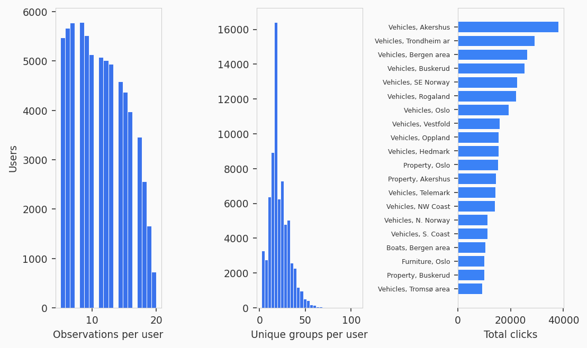

Descriptive Study of Classifieds Choice
=======================================

How consistent are 70,000 users on Norway's largest classifieds
platform? We map 1.3 million unique listings to 290 category-geography
groups, run SARP, Houtman-Maks, and RUM tests at scale, and compare
search versus recommendation behavior.

.. raw:: html

   

.. image:: ../_static/fig2_consistency_portrait.png
   :width: 80%
   :align: center
   :alt: Distribution of Houtman-Maks consistency ratios across FINN.no users

.. raw:: html

   

Platform and Data
-----------------

FINN.no is Norway's leading marketplace for real estate, vehicles, jobs,
and general merchandise. The FINN.no Slates dataset (Eide et al., RecSys
2021) records 37.5 million interactions from 2.3 million users over 30
days. Each interaction logs the full slate of items shown and which item
was clicked. About 70 percent of slates come from user-initiated search
and 30 percent from recommendations. Unlike most recommendation
datasets, the choice set is directly observed by the platform rather
than reconstructed from browsing sessions.

Individual listings are unique, so the same item rarely appears in
multiple slates. This study maps each item to one of 290
category-geography groups defined in the dataset metadata. Groups
combine a product category with a Norwegian county. BAP is the
marketplace section for general goods (electronics, furniture,
clothing), MOTOR covers vehicles, REAL_ESTATE covers property, JOB
covers job postings, and BOAT covers boats. A group like "MOTOR,
Rogaland" means motor vehicles listed in Rogaland county. At the group
level, overlap across slates rises from 6 percent to 63 percent, which
is dense enough for meaningful SARP and WARP testing.

.. raw:: html

   

Results
-------

The table below summarizes the main findings across 69,752 users at the
group level, with item-level results for comparison. The Rust Engine
processed all 69,752 group-level users in 2.1 seconds.

.. list-table::
   :header-rows: 1
   :widths: 30 20 20 20

   * - Metric
     - Group (290)
     - Item (all)
     - Item (dense)
   * - Users
     - 69,752
     - 93,858
     - 16,708
   * - SARP pass rate
     - 9.6%
     - 41.5%
     - 13.6%
   * - WARP pass rate
     - 10.0%
     - 42.0%
     - ---
   * - HM ratio (mean)
     - 0.874
     - 0.980
     - 0.819
   * - HM ratio (median)
     - 0.889
     - 0.991
     - 0.833
   * - Item overlap
     - 62.7%
     - 25.7%
     - ---
   * - Random baseline SARP
     - 7.9%
     - ---
     - ---

The "Item (all)" column treats each unique listing as a separate item.
Most users appear highly rational because there are too few repeated
items to form preference cycles. The "Item (dense)" column restricts to
the top 20 percent of users by observation count and keeps only each
user's 50 most frequently chosen items. This filters to the users and
items with enough data to actually test consistency. Their results are
close to the group-level analysis, which validates the aggregation.

Stochastic Consistency
~~~~~~~~~~~~~~~~~~~~~~

Only 5 percent of users (3,462 out of 69,752) have three or more
repeated group-level menus, which is the minimum needed for a Random
Utility Model test. Among those who qualify, 6.4 percent pass the RUM
test and 75.6 percent satisfy regularity. The combinatorial diversity
of slate compositions on a large marketplace limits the applicability
of stochastic choice models even after collapsing items into groups.

.. image:: ../_static/fig3_stochastic.png
   :width: 55%
   :align: center
   :alt: Distribution of repeated menus per user

.. raw:: html

   

Search vs Recommendation
~~~~~~~~~~~~~~~~~~~~~~~~

Splitting users at the median search ratio (0.84) produces two groups
of roughly 35,000 each. Users who predominantly click from search
results are less consistent than recommendation users (median HM 0.857
versus 0.914, SARP pass rate 7.7 versus 11.5 percent, Mann-Whitney
p < 0.0001). This is the opposite of the naive expectation that search
intent produces clearer preferences. One explanation is that search
users browse more diverse categories across sessions while
recommendation users see narrower, more repetitive slates.

.. image:: ../_static/fig4_search_vs_reco.png
   :width: 55%
   :align: center
   :alt: Overlapping distributions of HM ratio for search-heavy vs recommendation-heavy users

.. raw:: html

   

Violation Anatomy
~~~~~~~~~~~~~~~~~

Among the 63,050 users who fail SARP, most violations involve small
preference cycles of 4 items on average. The typical largest strongly
connected component has 5 groups, suggesting that violations come from
a handful of confusable category-geography pairs rather than wholesale
randomness.

.. image:: ../_static/fig5_violations.png
   :width: 80%
   :align: center
   :alt: SCC size distribution and cycle length distribution for SARP violators

.. raw:: html

   

Pipeline
--------

The analysis uses DuckDB for data loading (13.6 seconds for 100,000
raw users), the Rust Engine for SARP, WARP, and HM batch analysis (2.1
seconds for 69,752 users), and the Rust RUM batch API for stochastic
consistency (12.1 seconds for 3,462 users). The full pipeline
reproduces in under a minute.

.. code-block:: python

   from case_studies.finn_slates.group_loader import load_group_level
   from prefgraph import Engine

   user_logs, group_labels, stats = load_group_level(max_users=100_000)
   engine = Engine()
   results = engine.analyze_menus(
       [log.to_engine_tuple() for log in user_logs.values()]
   )

.. code-block:: bash

   python3 case_studies/finn_slates/run_analysis.py --max-users 100000
