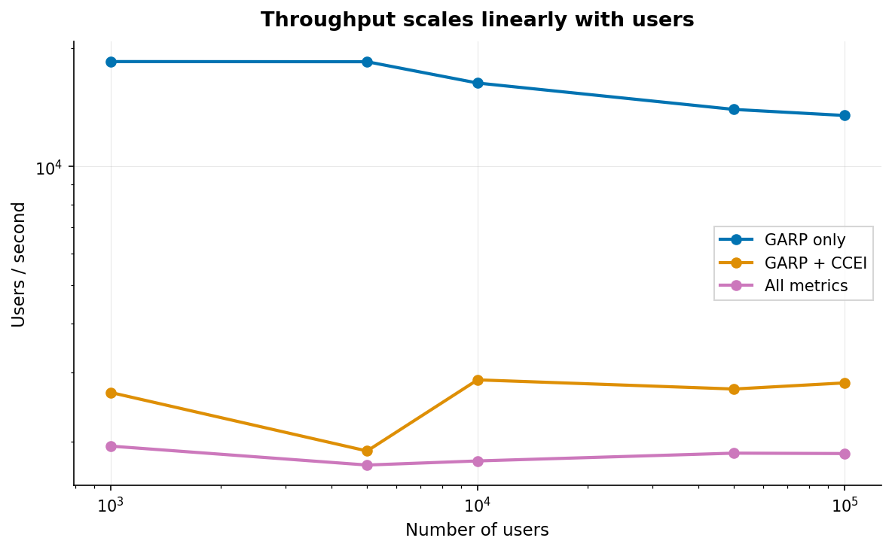
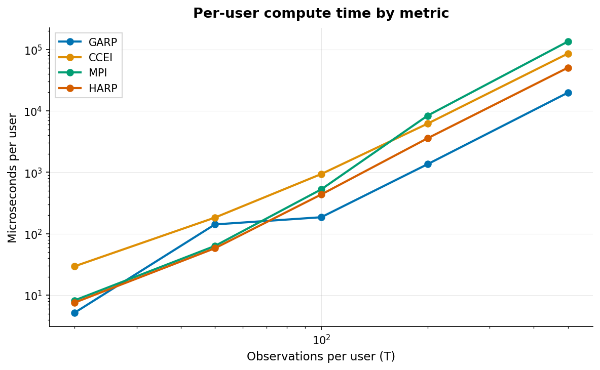
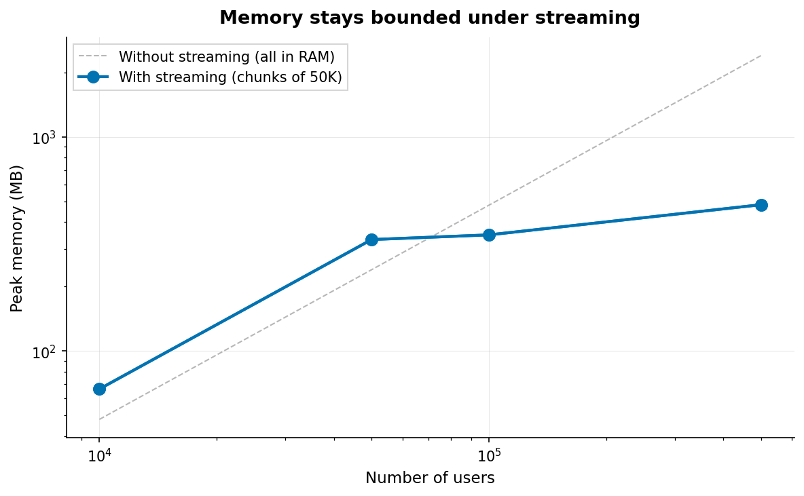

Performance
===========

PyRevealed uses a Rust compute engine (``rpt-core``) with Rayon thread-pool
parallelism, SCC-optimized transitive closure, and HiGHS LP solving. This
page shows raw scaling benchmarks.

Throughput at Scale
-------------------

Throughput stays constant as the number of users grows — the workload is
embarrassingly parallel and memory is bounded via streaming chunks.

.. list-table:: Throughput by metric combination (T=20-100, K=5)
   :header-rows: 1
   :widths: 40 20 20

   * - Metrics
     - Throughput
     - Per user
   * - GARP only
     - ~12,000/s
     - 80 us
   * - GARP + CCEI
     - ~2,400/s
     - 420 us
   * - GARP + CCEI + MPI + HARP
     - ~2,000/s
     - 500 us

Per-User Cost by Metric
-----------------------

Each metric adds cost independently. GARP and MPI are cheapest (graph-only).
CCEI is most expensive (binary search over ~15 GARP re-checks).

All graph algorithms scale as O(T^3) in the inner Floyd-Warshall loop, but
SCC decomposition reduces the effective T to the largest strongly connected
component — often much smaller than T for real economic data.

Memory Under Streaming
----------------------

Memory stays bounded regardless of how many users you score. The engine
processes users in chunks (default 50,000) and frees each chunk before
loading the next.

Peak memory is determined by chunk size, not total users. With 50K-user
chunks, expect ~100-200 MB peak regardless of whether you're scoring
100K or 10M users.

Algorithm Complexity
--------------------

.. list-table::
   :header-rows: 1
   :widths: 25 20 55

   * - Algorithm
     - Complexity
     - Notes
   * - GARP
     - O(T^3) / O(sum k_i^3)
     - SCC decomposition reduces to sum of cubic SCC sizes
   * - CCEI (AEI)
     - O(T^2 log T) * GARP
     - Discrete binary search over T^2 efficiency ratios
   * - MPI
     - O(T^2) after GARP
     - Scans violation pairs from GARP's closure matrix
   * - HARP
     - O(T^3)
     - Modified Floyd-Warshall in log-space (max-product paths)
   * - Houtman-Maks
     - O(T^2) greedy / ILP exact
     - Greedy FVS default; ILP via HiGHS for T <= 200
   * - Utility recovery
     - O(T^2) constraints
     - LP with 2T variables, T(T-1) constraints (HiGHS solver)
   * - VEI
     - O(T^2) constraints
     - Per-observation efficiency via LP

Hardware
--------

All benchmarks run on Apple M-series (11 cores). The Rust engine scales
linearly with core count. On a 64-core server, multiply throughput by ~5x.
