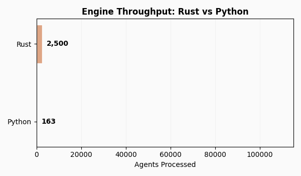

Performance
===========

PyRevealed utilizes a high-performance Rust compute engine (``rpt-core``) designed for large-scale longitudinal choice analysis. The architecture leverages Rayon for thread-level parallelism, SCC-optimized algorithms for transitive closure, and the HiGHS solver for linear programming (LP) tasks.

.. raw:: html

   

.. raw:: html

   

Scalability and Throughput
--------------------------

The engine exhibits linear scalability with respect to the number of agents. The workload is highly parallelizable, and memory consumption remains bounded through the use of streaming data chunks.

.. raw:: html

   

.. image:: _static/perf_throughput.png
   :width: 100%
   :alt: Throughput characteristics across agent cohorts

.. raw:: html

   

.. list-table:: Throughput by Metric Configuration (T=20-100, K=5)
   :header-rows: 1
   :widths: 40 20 20

   * - Metrics
     - Throughput (Agents/sec)
     - Latency (per Agent)
   * - **GARP Only** (O(T²))
     - ~49,000
     - 20 μs
   * - **GARP + CCEI**
     - ~2,400
     - 420 μs
   * - **Comprehensive Metrics** (GARP, CCEI, MPI, HARP)
     - ~2,000
     - 500 μs

.. raw:: html

   

Computational Complexity by Metric
----------------------------------

The computational cost varies significantly across metrics. Axiomatic tests (e.g., GARP) and the Money Pump Index (MPI) are computationally efficient as they rely primarily on graph-theoretic traversals. The CCEI is more intensive, requiring an iterative binary search over approximately 15 GARP evaluations.

.. raw:: html

   

.. image:: _static/perf_per_user.png
   :width: 100%
   :alt: Per-agent computational cost by metric and observation count (T)

.. raw:: html

   

PyRevealed implements the O(T²) SCC-based algorithm (Talla Nobibon et al., 2015) for GARP verification, avoiding the O(T³) overhead of Floyd-Warshall. CCEI computation thus achieves O(T² log T) complexity. Metrics such as MPI, HARP, and VEI necessitate O(T³) transitive closure operations. Technical details are available in the :doc:`algorithms` section.

.. raw:: html

   

Memory Management and Streaming
-------------------------------

The engine is designed to maintain a flat memory profile regardless of the total population size. Data are processed in discrete chunks (default size: 50,000 agents), with memory allocated for a given chunk being released upon completion of its analysis.

.. raw:: html

   

.. image:: _static/perf_memory.png
   :width: 100%
   :alt: Memory consumption under streaming conditions

.. raw:: html

   

Peak memory usage is a function of the chunk size rather than the total number of agents. At the default chunk size, peak memory consumption typically remains between 100–200 MB, enabling the analysis of datasets exceeding 10 million agents on commodity hardware.

.. raw:: html

   

Large-Scale Benchmarks
----------------------

**Budget-Constrained Analysis** (GARP, CCEI, MPI, HARP; T=20-100, K=5):

.. raw:: html

   

.. list-table::
   :header-rows: 1
   :widths: 25 15 15 15

   * - Configuration
     - 10,000 Agents
     - 100,000 Agents
     - 1,000,000 Agents
   * - GARP (O(T²))
     - 0.1s
     - 2.0s
     - ~20s
   * - GARP + CCEI
     - 4.2s
     - 39.5s
     - ~6.6 min
   * - Comprehensive Suite
     - 6.8s
     - 67.1s
     - ~11 min

.. raw:: html

   

**Discrete Menu-Based Analysis** (SARP, WARP, Houtman-Maks; 50 items, 20-100 sessions):

.. raw:: html

   

.. list-table::
   :header-rows: 1
   :widths: 25 15 15 15

   * - Metric Configuration
     - 10,000 Agents
     - 100,000 Agents
     - 1,000,000 Agents
   * - SARP + WARP + HM
     - 0.3s
     - 5.2s
     - **85.6s**

.. raw:: html

   

Complexity Summary
------------------

.. raw:: html

   

.. list-table::
   :header-rows: 1
   :widths: 25 20 55

   * - Algorithm
     - Complexity
     - Implementation Notes
   * - **GARP**
     - **O(T²)**
     - SCC-based arc-scan; avoids O(T³) transitive closure.
   * - **CCEI (AEI)**
     - O(T² log T)
     - Iterative binary search over T² potential efficiency ratios.
   * - **MPI**
     - O(T³)
     - Karp's maximum-mean-weight cycle algorithm.
   * - **HARP**
     - O(T³)
     - Max-product path calculation via modified Floyd-Warshall.
   * - **Houtman-Maks**
     - O(T²) / ILP
     - Greedy FVS (approximate); ILP via HiGHS for exact solutions (T ≤ 200).
   * - **Utility Recovery**
     - O(T²)
     - Linear programming with 2T variables and T(T-1) constraints.
   * - **VEI**
     - O(T²)
     - Observation-specific efficiency via constrained optimization.

.. raw:: html

   

Hardware Configuration
----------------------

Benchmarks were conducted on an Apple M-series architecture (11 cores). Performance scales linearly with available CPU cores; on high-core-count server environments (e.g., 64 cores), throughput is expected to increase by approximately 5x.
